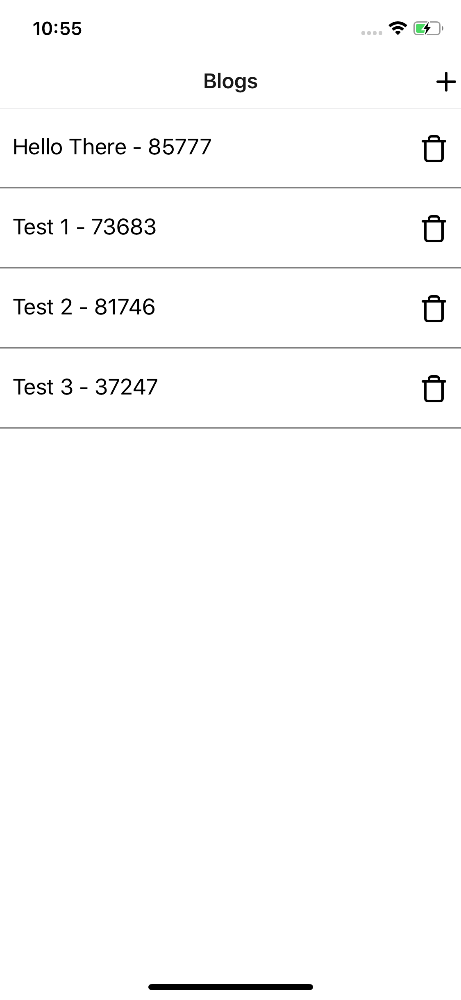

# React native ContextAPI demo with hooks useState, useReducer, useContext

This demo app build with expo and shows how to use hooks in react-native version 0.60 with context ContextAPI.
In this sample demo, following functionalities are implemented
* Create blog with two form fields
* Edit selected blog
* Delete selected blog
* Listing of added Blogs
* Use of Navigation

## Versions

      react-native-cli: 2.0.1
      react-native: 0.60
      node: 12.6.0

## Quick Start

      ```
    run yarn or yarn install

    ```

     ```
     expo start

     ```

## Dependencies
```
"expo": "^34.0.1",
"react": "16.8.3",
"react-dom": "^16.8.6",
"react-native": "https://github.com/expo/react-native/archive/sdk-34.0.0.tar.gz",
"react-native-gesture-handler": "~1.3.0",
"react-native-reanimated": "~1.1.0",
"react-native-web": "^0.11.4",
"react-navigation": "^4.0.4",
"react-navigation-stack": "^1.7.3"

```
### > Attachments



