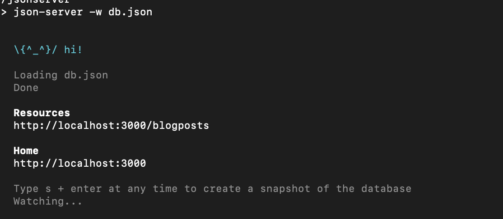
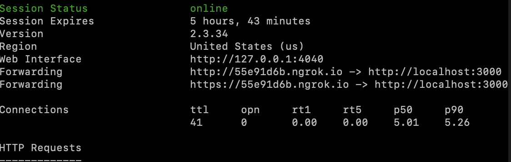

# React native ContextAPI demo with hooks useState, useReducer, useContext, useEffect

This demo app build with expo and shows how to use hooks in react-native version 0.60 with context ContextAPI.
In this sample demo, following functionalities are implemented
* Create blog with two form fields
* Edit selected blog
* Delete selected blog
* Listing of added Blogs
* Use of Navigation


> This respository has two branches
* master -> brach is without api
* dev -> branch is with api


## For local Server setup I used following dependencies
```
  json-server
  ngrok

```


> ** To  run local server on your machine open terminal and go to path till
 ```  
  cd server/jsonServer
  ```
  > * run following commands on separate terminal

  ```
    npm run db

  ```  

  ```
    npm run tunnel

  ```  
  * if everything setup perfectly then it will run image like followings in terminal
  > Image of local db
    
  > image of tunnel
   


## Versions

      react-native-cli: 2.0.1
      react-native: 0.60
      node: 12.6.0


  > ** if you are going to use react-navigation version 4.0 or above you need to install separate dependencies for navigation
      like I installed in this demo


          react-navigation: "^4.0.4", // it is used for createAppContainer
          react-navigation-stack  // it is used for createStackNavigator

    ** Similarly you have to install Tabbar dependency


## Quick Start


    * run yarn or yarn install

    * expo start


## Dependencies
```
"expo": "^34.0.1",
"react": "16.8.3",
"react-dom": "^16.8.6",
"react-native": "https://github.com/expo/react-native/archive/sdk-34.0.0.tar.gz",
"react-native-gesture-handler": "~1.3.0",
"react-native-reanimated": "~1.1.0",
"react-native-web": "^0.11.4",
"react-navigation": "^4.0.4",
"react-navigation-stack": "^1.7.3"

```
###  Attachments


